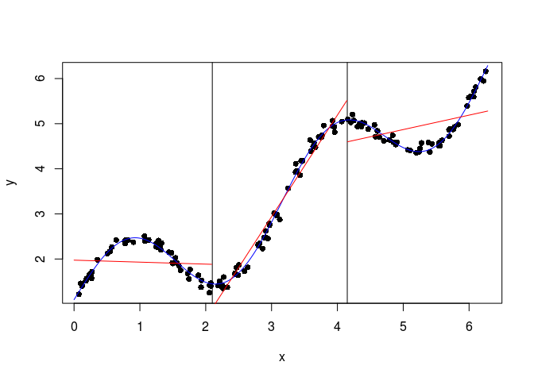
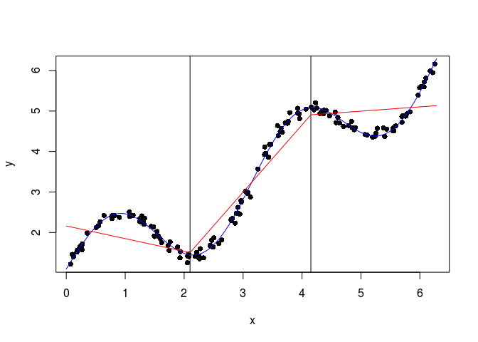

# Basis Functions

In this file I show how to implement basis functions such linear intercept, linear discontinuous, linear continuos, cubic splines and quadratic functions.
This file is part of my project for advanced data mining course with Prof. Culp.

``` r
######
## f(x) Regression Example
######
set.seed(100)
x=runif(150,0,2*pi)
f<-function(x){sin(2*x)+log(exp(x)+2)}
y=f(x)+rnorm(150,,0.1)

plot(x,y,pch=16)
psi1=2.1
psi2=4.15
abline(v=c(psi1,psi2))

xgrid=seq(0,2*pi,length=500)
n=length(xgrid)
ygrid=vector(length=n)

####Compute (get h)
m=150
##Linear (intercpt)
h1=h2=h3=rep(0,m)
ind<-x< psi1
h1[ind]=1
ind<-x> psi1 & x<psi2
h2[ind]=1
ind<-x> psi2
h3[ind]=1
h=cbind(h1,h2,h3)

bls=solve(t(h)%*%h,t(h)%*%y)

for(i in 1:n){
  ## Set-up prediction (h0)
  x0=xgrid[i]
  ##Linear (intercept)
  h10=h20=h30=0
  if (x0 < psi1){
    h10 = 1
  } else if (x0 < psi2){
    h20 = 1     
  } else {
    h30 = 1
  }
  h0=cbind(h10,h20,h30)
  ygrid[i]=as.vector(h0%*%bls)
}


lines(xgrid,f(xgrid),col=c("blue"))
ind<-xgrid< psi1
lines(xgrid[ind],ygrid[ind],col=c("red"))

ind<-xgrid> psi1 & xgrid<psi2
lines(xgrid[ind],ygrid[ind],col=c("red"))

ind<-xgrid> psi2
lines(xgrid[ind],ygrid[ind],col=c("red"))
```


``` r
## Linear (discontinuous)
h1=h2=h3=h4=h5=h6=rep(0,m)
ind<-x< psi1
h1[ind]=1
h4[ind]=x[ind]
ind<-x> psi1 & x<psi2
h2[ind]=1
h5[ind]=x[ind]
ind<-x> psi2
h3[ind]=1
h6[ind]=x[ind]
h=cbind(h1,h2,h3,h4,h5,h6)

bls=solve(t(h)%*%h,t(h)%*%y)

for(i in 1:n){
  ## Set-up prediction (h0)
  x0=xgrid[i]
   h10=h20=h30=h40=h50=h60=0
  if (x0 < psi1){
    h10 = 1
    h40 = x0
  } else if (x0 < psi2){
    h20 = 1
    h50 = x0        
  } else {
    h30 = 1
    h60 = x0
  }
  h0=cbind(h10,h20,h30,h40,h50,h60)
  ygrid[i]=as.vector(h0%*%bls)
}

plot(x,y,pch=16)
psi1=2.1
psi2=4.15
abline(v=c(psi1,psi2))
lines(xgrid,f(xgrid),col=c("blue"))
ind<-xgrid< psi1
lines(xgrid[ind],ygrid[ind],col=c("red"))

ind<-xgrid> psi1 & xgrid<psi2
lines(xgrid[ind],ygrid[ind],col=c("red"))

ind<-xgrid> psi2
lines(xgrid[ind],ygrid[ind],col=c("red"))
```



``` r
## Linear (continuous)
h1=rep(1,m)
h2=x
h3=h4=rep(0,m)
ind<-x> psi1
h3[ind]=x[ind]-psi1
ind<-x> psi2
h4[ind]=x[ind]-psi2
h=cbind(h1,h2,h3,h4)

bls=solve(t(h)%*%h,t(h)%*%y)

for(i in 1:n){
  ##Linear (continuous)
  x0=xgrid[i]
  h30=h40=0
  if (x0 > psi1){
    h30 = x0 - psi1 
  } 
  if (x0 > psi2){
    h40 = x0 - psi2
  }
  h0=cbind(1,x0,h30,h40)
  ygrid[i]=as.vector(h0%*%bls)
}

plot(x,y,pch=16)
psi1=2.1
psi2=4.15
abline(v=c(psi1,psi2))
lines(xgrid,f(xgrid),col=c("blue"))
ind<-xgrid< psi1
lines(xgrid[ind],ygrid[ind],col=c("red"))

ind<-xgrid> psi1 & xgrid<psi2
lines(xgrid[ind],ygrid[ind],col=c("red"))

ind<-xgrid> psi2
lines(xgrid[ind],ygrid[ind],col=c("red"))
```



``` r
##Quadratic (continuous)
h1=rep(1,m)
h2=x
h3=x^2
h4=h5=rep(0,m)
ind<-x> psi1
h4[ind]=(x[ind]-psi1)^2
ind<-x> psi2
h5[ind]=(x[ind]-psi2)^2
h=cbind(h1,h2,h3,h4,h5)

bls=solve(t(h)%*%h,t(h)%*%y)

for(i in 1:n){
   ##Quadratic (continuous)
  x0=xgrid[i]
  h40=h50=0
  if (x0 > psi1){
    h40 = (x0 - psi1)^2 
  } 
  if (x0 > psi2){
    h50 = (x0 - psi2)^2
  }
  h0=cbind(1,x0,x0^2,h40,h50)
  ygrid[i]=as.vector(h0%*%bls)
}

plot(x,y,pch=16)
psi1=2.1
psi2=4.15
abline(v=c(psi1,psi2))
lines(xgrid,f(xgrid),col=c("blue"))
ind<-xgrid< psi1
lines(xgrid[ind],ygrid[ind],col=c("red"))

ind<-xgrid> psi1 & xgrid<psi2
lines(xgrid[ind],ygrid[ind],col=c("red"))

ind<-xgrid> psi2
lines(xgrid[ind],ygrid[ind],col=c("red"))
```


``` r
##Cubic (continuous)
h1=rep(1,m)
h2=x
h3=x^2
h4=x^3
h5=h6=rep(0,m)
ind<-x> psi1
h5[ind]=(x[ind]-psi1)^3
ind<-x> psi2
h6[ind]=(x[ind]-psi2)^3
h=cbind(h1,h2,h3,h4,h5,h6)

bls=solve(t(h)%*%h,t(h)%*%y)

for(i in 1:n){
  x0=xgrid[i]
  h50=h60=0
  if (x0 > psi1){
    h50 = (x0 - psi1)^3 
  } 
  if (x0 > psi2){
    h60 = (x0 - psi2)^3
  }
  h0=cbind(1,x0,x0^2,x0^3,h50,h60)  
  ygrid[i]=as.vector(h0%*%bls)
}

plot(x,y,pch=16)
psi1=2.1
psi2=4.15
abline(v=c(psi1,psi2))
lines(xgrid,f(xgrid),col=c("blue"))
ind<-xgrid< psi1
lines(xgrid[ind],ygrid[ind],col=c("red"))

ind<-xgrid> psi1 & xgrid<psi2
lines(xgrid[ind],ygrid[ind],col=c("red"))

ind<-xgrid> psi2
lines(xgrid[ind],ygrid[ind],col=c("red"))
```


